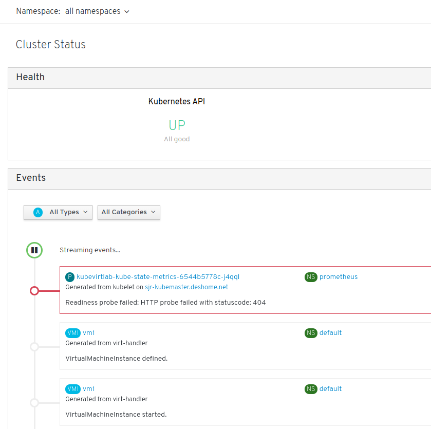
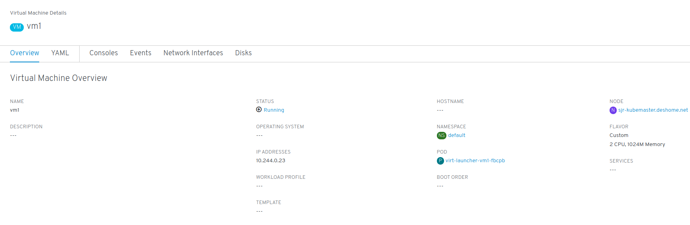
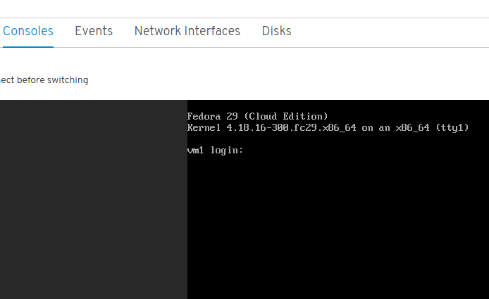

# Lab 5

## Exploring the KubeVirt UI

Using your browser, head to *http://<your_gcp_instance_hostname>:30000* and you'll be greeted by an status page showing the health of the cluster and a stream of events.

On the left side navigation bar, click on *Workloads* and then *VirtualMachines*, we'll be presented with a view of the defined VMs, click on the VM1 to open up its details.

Notice all the tabs we have available, *YAML*, *Consoles*, ... click on *Consoles*

[Next Lab](../lab4/lab6.md)\
[Previous Lab](../lab2/lab4.md)\
[Home](../../README.md)
