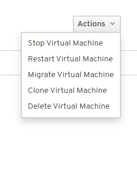

# Lab 5

## Exploring the KubeVirt UI

Using your browser, head to *http://<your_gcp_instance_hostname>:30000* and you'll be greeted by an status page showing the health of the cluster and a stream of events.

On the left side navigation bar, click on *Workloads* and then *VirtualMachines*, we'll be presented with a view of the defined VMs, click on the VM1 to open up its details.

Notice all the tabs we have available, *YAML*, *Consoles*, ... click on *Consoles*

Click now on the *actions* button, it will present you with few options:

We can interact with our VM from the UI as well, note the *Migrate* action available, not really useful for this lab as we are running a single node cluster, but clicking it on a multi-node cluster would trigger a live migration of the VM.

The UI uses a graphical console for connecting to the VM, which can be also used from *virtctl* using the *vnc* subcommand. Note that it requires to have `remote-viewer` installed and it's out of the scope of this lab.

This concludes this lab! Take your time exploring the UI and when your ready head to the next one!

[Next Lab](../lab6/lab6.md)\
[Previous Lab](../lab4/lab4.md)\
[Home](../../README.md)
