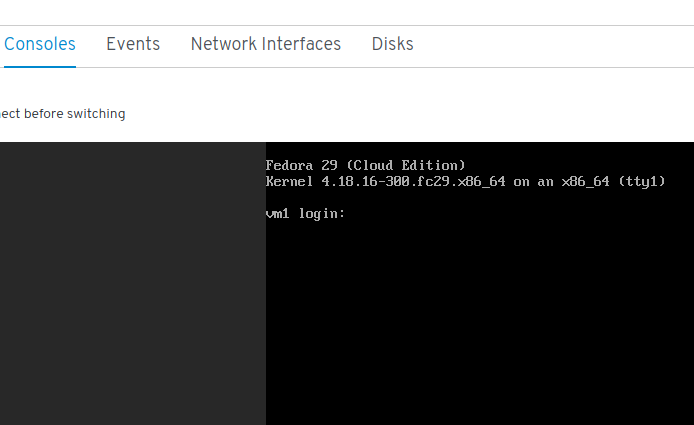

# Lab 6

## Install the KubeVirt Web UI

```console
$ cd ~/kubevirt/kubevirt-ui-custom-manifests
$ kubectl config set-context $(kubectl config current-context) --namespace=kubevirt
$ kubectl create -f kubevirt_ui.yml
$ kubectl wait pod -l app=kubevirt-web-ui --for condition=Ready --timeout=180s
pod/kubevirt-web-ui-qmpwl condition met
```

Check the three resources deployed for the Web UI:

```console
$ kubectl get all -l app=kubevirt-web-ui
NAME                        READY   STATUS    RESTARTS   AGE
pod/kubevirt-web-ui-qmpwl   1/1     Running   0          78m

NAME                                    DESIRED   CURRENT   READY   AGE
replicationcontroller/kubevirt-web-ui   1         1         1       78m

NAME                      TYPE       CLUSTER-IP     EXTERNAL-IP   PORT(S)          AGE
service/kubevirt-web-ui   NodePort   10.96.35.132   <none>        9000:30000/TCP   78m
```

**NOTE**: Pay special attention to the kubevirt-web-ui service, the UI should be available on your node's assigned hostname at port 30000.

## Exploring the KubeVirt UI

Using your browser, head to *http://<your_gcp_instance_hostname>:30000* and you'll be greeted by an status page showing the health of the cluster and a stream of events.


On the left side navigation bar, click on *Workloads* and then *VirtualMachines*, we'll be presented with a view of the defined VMs in the cluster, click on the *vm1* to open up its details.


Notice all the tabs we have available, *YAML*, *Consoles*, ... click on *Consoles*



Click now on the *actions* button, it will present you with few options:


We can interact with our VM from the UI as well, note the *Migrate* action available, not really useful for this lab as we are running a single node cluster, but clicking it on a multi-node cluster would trigger a live migration of the VM.

The UI uses a graphical console for connecting to the VM, which can be also used from *virtctl* using the *vnc* subcommand. Note that it requires to have `remote-viewer` installed and it's out of the scope of this lab.

Now let's get back clicking on *Workloads*, *VirtualMachines* and review the details for *vm2*, take a close look to its disks:


To have more details, go to the *Storage* section and click on *Persistent Volume Claims*, we'll be presented with the summary of *PVCs* on the cluster, most likely one, *vm2-dv*, open it up:


Here we can see its owner, the *DataVolume vm2-dv* and the physical volume attached to this claim, the *local-pv-6035a584* *PV*.


This concludes this lab! Take your time exploring the UI and when your ready head to the next one!

[Next Lab](../lab7/lab7.md)\
[Previous Lab](../lab5/lab5.md)\
[Home](../../README.md)
