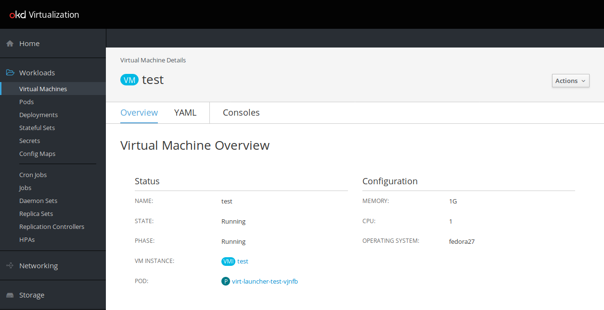
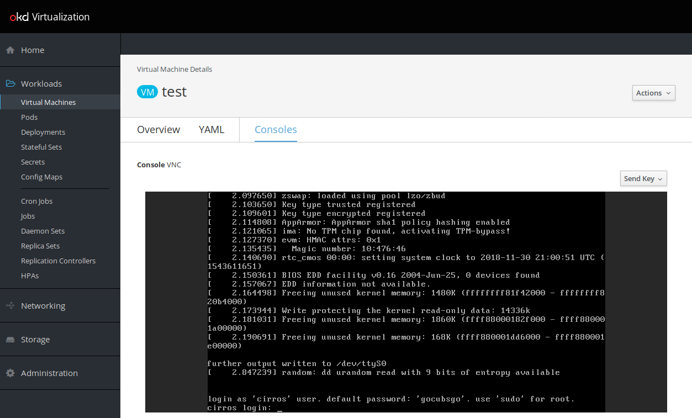

# Lab 7: Using the Kubevirt UI to interact with VMs

In this section we will deploy and interact with VMs using KubeVirt's web-based user interface.

You can then access the web UI at `http://kubevirtlab-<number>.<domain>:30000` and use it to:

* stop/start/delete/... VMs
* Create new ones
* Access VM consoles through your browser

## Using the KubeVirt web UI 

### Create a Virtual Machine

> **NOTE:** at the time of this writing, the WebUI is fully functional on
> OpenShift but not yet in Kubernetes (we are working on it! :D). In Kubernetes
> if you try to spin up a VM using the *wizard* the namespaces will not be
> shown, preventing this workflow to complete. For now, on a Kubernetes
> environment, just skip this section about the create VM wizard and look at the
> other UI features.

Click the `Create Virtual Machine` drop-down and select `Create with Wizard`

In the `Basic Settings` configure with the following

* Name: `test`
* Namespace: `myproject`
* Provision Source: `Container`
* Container Image: `docker.io/kubevirt/cirros-container-disk-demo:latest`
* Operating System: `fedora29`
* Flavor: `Custom`
* Memory: `1`
* CPUs: `1`
* Workload Profile: `generic`

Click `Next >` until result and finish.

### Controlling the State of the VM

To start the virtual machine click the cog and select `Start Virtual Machine`.

Now click the virtual machine link `test`

### Virtual Machine Overview and Console

While looking at a VM's detailed page:

click the *Consoles* tab to view its graphical (VNC) console:

### Associated Pods

Virtual Machines run inside pods. Navigate to *Workloads -> Pods* to see a list of the pods that are currently running in the selected namespace:

Then clicking on a specific pod's name will provide an overview of the pod:

#### Exercise

- The pod details page has a *Terminal* tab. Is there any relationwhip between that tab and the *Consoles* tab in the VM details page?

- Is there more than one container in the pod? What does each container do?

This concludes this section of the lab.

[Next Lab](../lab8/lab8.md)\
[Previous Lab](../lab6/lab6.md)\
[Home](../../README.md)
