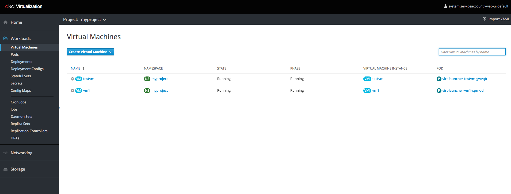
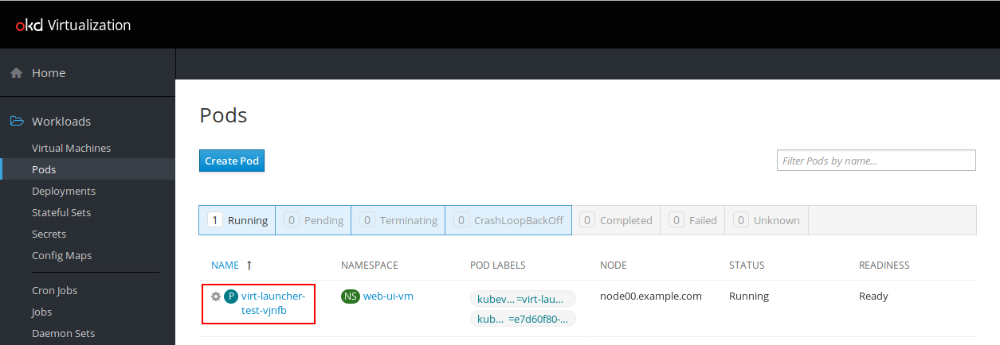

# Lab 7

## Using the Kubevirt UI to interact with VMs

In this section, we will install and interact with VMs using KubeVirt's dedicated UI.

You can then access it at `http://kubevirtlab-<number>.<domain>:30000` and use it to:

* stop/start/delete/... VMs
* Create new ones
* Access VM consoles through your browser

### Using the KubeVirt web UI 

#### Create a Virtual Machine

Click the `Create Virtual Machine` drop-down and select `Create with Wizard`

In the `Basic Settings` configure with the following

* Name: `vm3`
* Namespace: `myproject`
* Provision Source: `Container`
* Container Image: `docker.io/kubevirt/cirros-container-disk-demo:latest`
* Operating System: `fedora29`
* Flavor: `Custom`
* Memory: `1`
* CPUs: `1`
* Workload Profile: `generic`

Click `Next >` until result and finish.

#### Controlling the State of the VM

To start the virtual machine click the cog and select `Start Virtual Machine`.

Now click the virtual machine link `vm3`

#### Virtual Machine Overview and Console

Click *Consoles* to view graphical (VNC) console.

#### Associated Pods

Clicking `Pods` will show the currently running pods for this namespace.

Then clicking the `virt-launcher-vm3-RANDOM` link will provide an overview.

This concludes this section of the lab.

[Next Lab](../lab8/lab8.md)\
[Previous Lab](../lab6/lab6.md)\
[Home](../../README.md)
